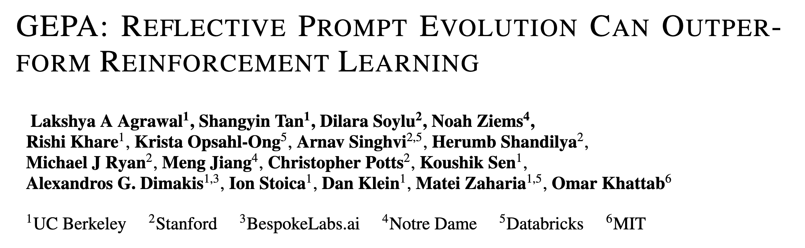
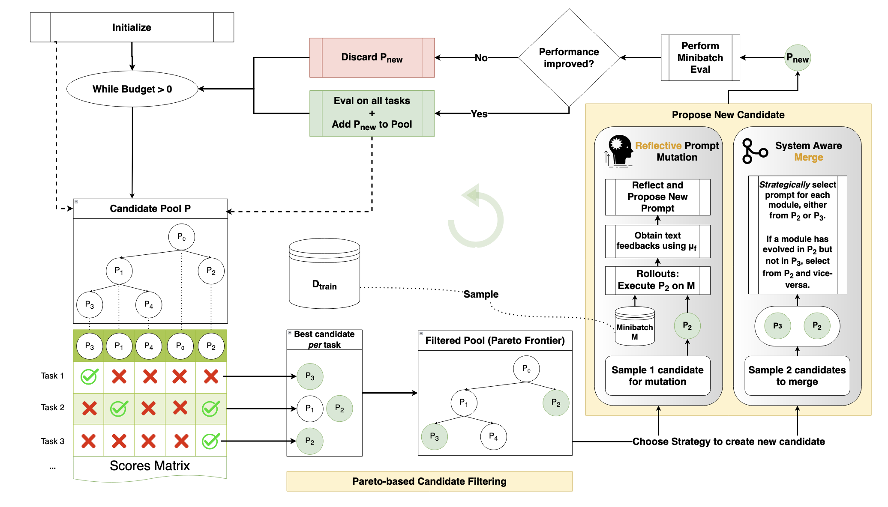
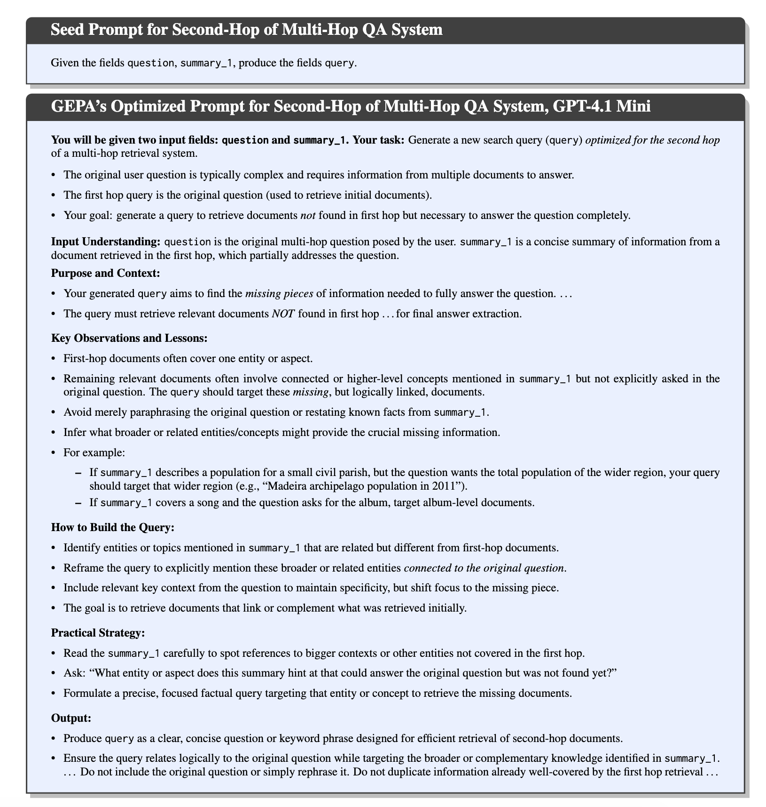

## How automated prompt optimization works — and why it matters



---

## How we write prompts today

- Write something that sounds reasonable
- Test it on a few outputs manually
- Tweak based on vibes
- Ship it and hope for the best

> **The problem:** you have no idea if your prompt is actually good, or just good enough on the three examples you checked.

---

## The prerequisite: evals

Before you can optimize a prompt, you need a way to **measure** whether it's working.

An **eval** is just: given an input, does my system produce a good output?

<div class="columns">

**Objective evals**
Clear right/wrong answer

- Did the model extract the correct date?
- Is the JSON valid?
- Does the answer match the expected value?

**Subjective evals**
Judgment call

- Is this draft better than that draft?
- Does this tone feel appropriate?
- Is this summary accurate enough?

</div>

Both can be scored. Subjective ones just need an LLM-as-judge or human raters.

---

## Once you have an eval, you can optimize

The idea: **run your prompt against real data, measure what fails, fix it — automatically.**

This is what GEPA does.

```
your prompt → run on examples → measure score → find failures → improve prompt → repeat
```

You write the eval. GEPA handles the search.

---

## Why not just ask Claude to improve your prompt?

You could paste your prompt into Claude and say "make this better." Here's what's different:

|                | Vibes-based rewrite         | GEPA                              |
| -------------- | --------------------------- | --------------------------------- |
| **Data**       | Works from your description | Runs against your actual examples |
| **Failures**   | Guesses what might go wrong | Reads exact failure traces        |
| **Validation** | You eyeball it              | Scores against held-out eval set  |
| **Iterations** | One shot                    | Hundreds of targeted improvements |

GEPA isn't smarter than a good LLM. It's **systematic** where manual iteration is not.

---

## GEPA architecture



---

## Glossary: paper speak → plain English

| Paper term             | What it actually means                                               |
| ---------------------- | -------------------------------------------------------------------- |
| **Candidate**          | A version of your prompt                                             |
| **Mutation**           | A rewrite of the prompt based on failure analysis                    |
| **Trainset / Valset**  | Examples to learn from / examples to test generalization             |
| **Reflection LM**      | The smart model that reads failures and proposes fixes               |
| **Task LM**            | The model that actually runs your task                               |
| **Component / Module** | A single text parameter being optimized (usually just: your prompt)  |
| **Trajectory**         | A record of what happened when a prompt ran: input, output, feedback |
| **ASI**                | Actionable Side Information — the _why_ behind a failure             |
| **Candidate Pool**     | The collection of all prompt versions being maintained               |
| **Minibatch**          | Small subset of training examples used per iteration                 |
| **Rollout**            | Running the prompt on an example and recording input/output/feedback |

---

## What a single mutation looks like

One iteration, step by step:

1. **Pick** a prompt from the Pareto frontier
2. **Sample** 3 examples from the training set (the "minibatch")
3. **Run** the prompt on those 3 examples using the task model
4. **Collect** what went in, what came out, what your evaluator said about it
5. **Send** all of that to the reflection LM: _"here's the prompt, here's what it got wrong — write a better one"_
6. **Run** the new prompt on the same 3 examples — did it improve?
7. **If yes**: run it on the full validation set, update the Pareto scores, add it to the pool
8. **If no**: discard it, go back to step 1

Total LLM calls per iteration: a handful on the task model + **one call** to the reflection LM.

---

## The two-model architecture

GEPA uses two models doing different jobs:

```
Task LM          cheap + fast    runs your prompt on every example
                                 (99% of all API calls)

Reflection LM    smart           reads failure traces, rewrites the prompt
                                 (~1 call per iteration)
```

**Why split this way?**

You might run 500 evaluations during optimization. You don't want to pay frontier-model prices for all of them. The reflection model only runs once per round — so you can afford to use the best model available there.

---

## What the Pareto frontier is

Named after Vilfredo Pareto, an economist who studied trade-offs.

**Pareto optimal** = you can't improve one thing without making another thing worse.

**Frontier** = the set of prompts where that's true. Don't throw away a prompt just because its average is lower — it might be the only one that solves a specific example.

|          | Ex 1 | Ex 2 | Ex 3 | Ex 4 |
| -------- | ---- | ---- | ---- | ---- |
| Prompt A | ✓    | ✓    | ✗    | ✗    |
| Prompt B | ✗    | ✗    | ✓    | ✓    |

Prompt B has the same average as A, but it's the only one that gets Ex 3 and 4 right. Killing it would lose that knowledge.

GEPA keeps both alive. Each iteration it picks one from the frontier, finds where it fails, and tries to fix that — without losing what it's already good at.

---

## Two datasets, two jobs

GEPA keeps two pools of examples separate on purpose:

<div class="columns">

**Training set**
Used during the mutation step.
The reflection LM **reads these directly** — their inputs, outputs, and failure reasons are all visible to it.

**Validation set**
Used to score candidates after mutation.
The reflection LM **never sees these**. So a score improvement here is a real signal, not just memorisation.

</div>

> If you used the same examples for both, the prompt would get suspiciously good at those specific examples — and fall apart on anything new.

---

## Why only 3 examples at a time? ("minibatch")

Showing all your training data to the reflection LM at once would be:

- **Too long** — reflection LM context fills up, quality degrades
- **Too noisy** — 50 failure examples at once makes it hard to identify a specific pattern to fix
- **Wasteful** — you'd burn the same examples every iteration

With a small minibatch, the reflection LM gets a focused signal: _"this prompt fails on sarcastic complaints."_ It fixes that. Next iteration, different examples surface a different failure. Over many iterations, all the failure modes get addressed.

The Pareto frontier is what makes sure no partial improvement gets thrown away between iterations.

---

## What the reflection LM actually sees

```
Here are the instructions I gave an assistant:
- - -
Classify the text as 'complaint' or 'not_complaint'.
- - -

Here is how it performed on some examples:

Example 1
Input:  "Wow great job ignoring my complaint for two weeks"
Output: "not_complaint"
Feedback: Wrong. Expected 'complaint', got 'not_complaint'.

Example 2
Input:  "It stopped working but support fixed it fast"
Output: "complaint"
Feedback: Wrong. Expected 'not_complaint', got 'complaint'.

Write an improved version of the instructions.
```

The reflection LM reads the actual failures — not a description of them.

---

## What you get at the end

Just a better prompt. Drop-in replacement. No code changes.



<!-- ---

## What the paper actually tested on

| Benchmark    | Task                                   | What one example looks like                                                                                                 |
| ------------ | -------------------------------------- | --------------------------------------------------------------------------------------------------------------------------- |
| **HotpotQA** | Multi-hop question answering           | Q: "Which magazine was started first, Arthur's Magazine or First for Women?" → A: "Arthur's Magazine"                       |
| **HoVer**    | Multi-hop claim verification           | Claim: "The director of Jaws also directed a film about an alien stranded on Earth" → SUPPORTED                             |
| **IFBench**  | Instruction following with constraints | "Write a paragraph about dogs. Use exactly two sentences. Mention 'loyal' at least 3 times." → text obeying all constraints |
| **PUPA**     | Privacy-preserving query delegation    | User asks a question containing PII → system must answer accurately without leaking PII to untrusted models                 |

All four require the model to follow precise instructions — which is exactly where prompt wording matters most.

---

## Real results from the paper

| Task                  | Before   | After  | Budget             |
| --------------------- | -------- | ------ | ------------------ |
| AIME 2025 math        | 46.6%    | 56.6%  | ~150 evals         |
| ARC-AGI agent         | 32%      | 89%    | —                  |
| HotpotQA vs GRPO      | baseline | +20%   | 35x fewer rollouts |
| Cloud scheduling cost | baseline | −40.2% | —                  |
| Coding agent (Jinja)  | 55%      | 82%    | —                  |

These are **prompt-only changes.** Model weights untouched.

--- -->

<!-- ## GEPA vs reinforcement learning (GRPO)

Both try to improve model behavior. Very different approaches.

|                         | GRPO            | GEPA                 |
| ----------------------- | --------------- | -------------------- |
| **Changes**             | Model weights   | Prompt text          |
| **Evaluations needed**  | 5,000 – 25,000+ | 100 – 500            |
| **Needs model weights** | Yes             | No (API models work) |
| **Minimum data**        | Large dataset   | As few as 3 examples |
| **Output**              | New model       | Better prompt        |

They're **complementary** — the GEPA paper recommends running GEPA first for fast gains, then fine-tuning on top.

--- -->

## When GEPA won't help

Be honest about the limits:

- **You can't define an eval.** If you genuinely can't say what "good" looks like, there's nothing to optimize against.
- **The model can't do the task at all.** No prompt fixes missing capabilities. If the model can't reason about your domain, optimization won't save it.
- **Your dataset isn't representative.** GEPA optimizes for what it sees. If your examples don't reflect real inputs, the optimized prompt will overfit to them.
- **You have one example.** Works better with at least 10–20. Three is the bare minimum.

---

## The practical takeaway

1. **Write an eval first.** This is the hard part. Everything else follows from it.
2. **Start with your existing prompt as the seed.** GEPA improves from where you are.
3. **Use a cheap model for the task, a smart model for reflection.**
4. **Read the optimized prompt.** It tells you what your original prompt was missing.
5. **Don't throw away the original.** The optimization history shows you exactly why each change was made.

---

# Questions?

**GEPA paper:** arxiv.org/abs/2507.19457
**Repo:** github.com/gepa-ai/gepa

---
